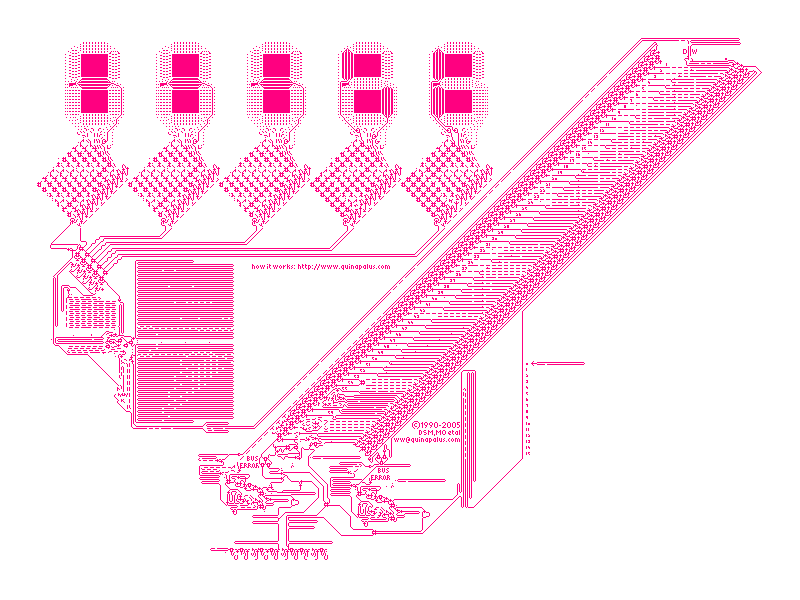

# Cellular Tomato

One of [Cellular Automata](https://en.wikipedia.org/wiki/Cellular_automaton) implementation for recreational purposes. This is so called [Wireworld](https://en.wikipedia.org/wiki/Wireworld).

## Quick Start

```console
$ mingw32-make.exe 
$ ./wireworld.exe
```

## Expected Result


